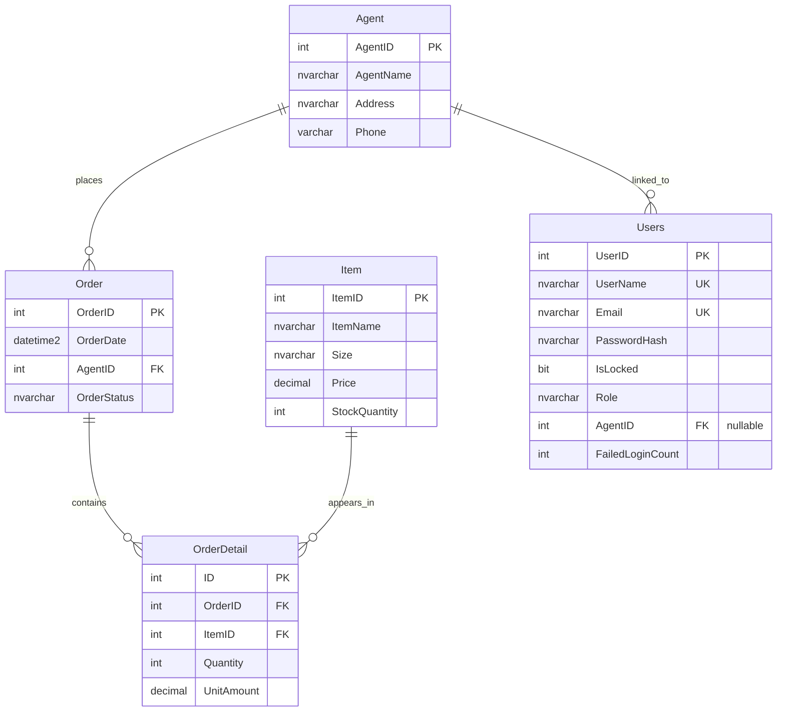

# B2B Wholesale - ERD

```mermaid
erDiagram
    Agent ||--o{ Order : places
    Order ||--o{ OrderDetail : contains
    Item ||--o{ OrderDetail : appears_in
    Agent ||--o{ Users : linked_to

    Agent {
      int AgentID PK
      nvarchar AgentName
      nvarchar Address
      varchar Phone
    }
    Item {
      int ItemID PK
      nvarchar ItemName
      nvarchar Size
      decimal Price
      int StockQuantity
    }
    Order {
      int OrderID PK
      datetime2 OrderDate
      int AgentID FK
      nvarchar OrderStatus
    }
    OrderDetail {
      int ID PK
      int OrderID FK
      int ItemID FK
      int Quantity
      decimal UnitAmount
    }
    Users {
      int UserID PK
      nvarchar UserName UK
      nvarchar Email UK
      nvarchar PasswordHash
      bit IsLocked
      nvarchar Role
      int AgentID FK "nullable"
      int FailedLoginCount
    }
```
